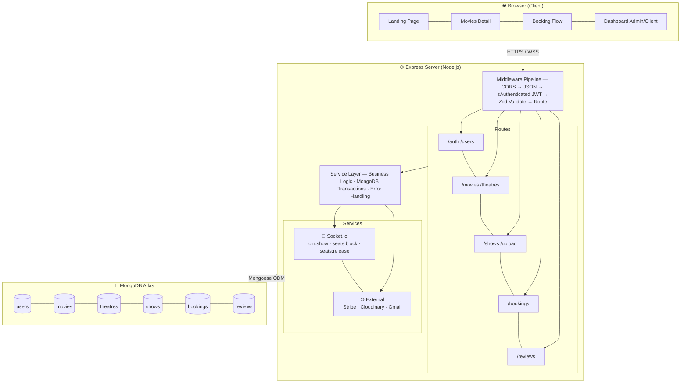
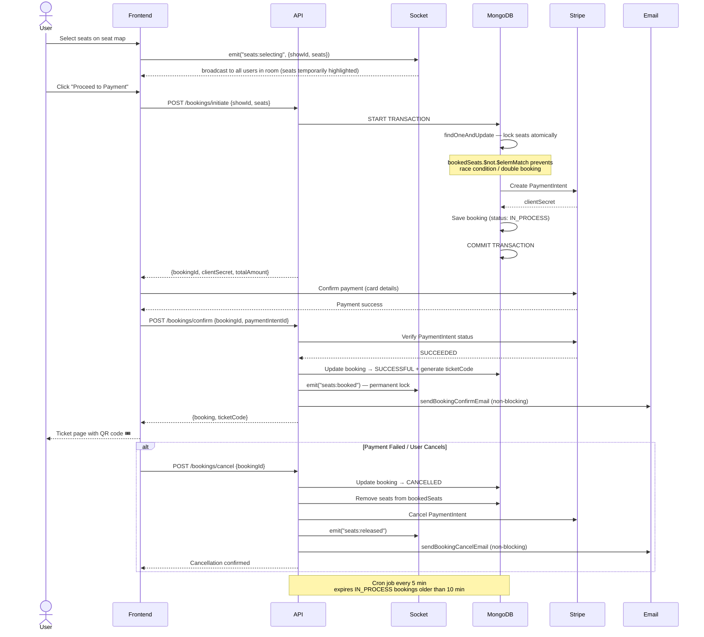
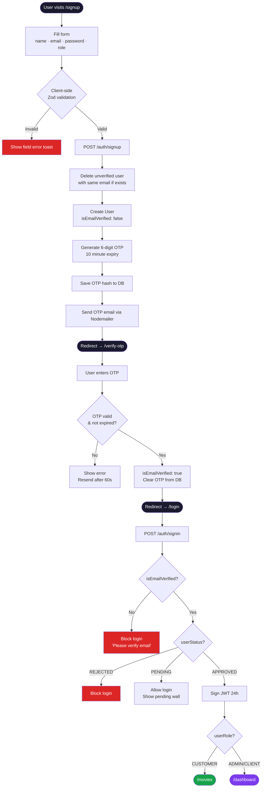
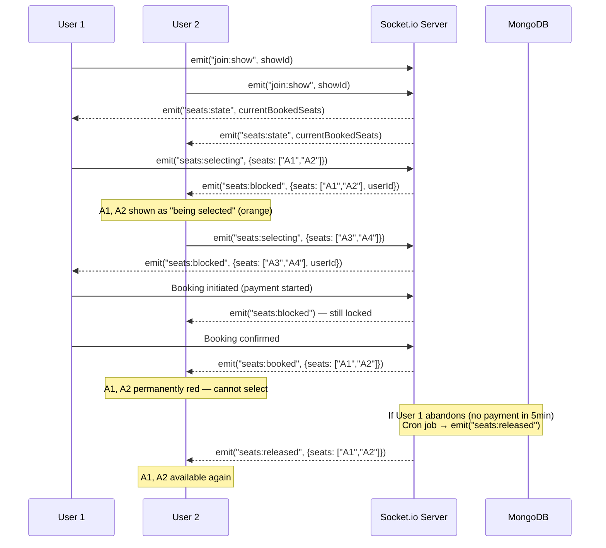

<div align="center">

# 🎬 CINEVERSE

### Production-Grade Movie Ticket Booking Platform

[](https://react.dev)
[](https://typescriptlang.org)
[](https://nodejs.org)
[](https://mongodb.com)
[](https://socket.io)
[](https://stripe.com)
[](https://cloudinary.com)

> A full-stack movie booking platform inspired by BookMyShow — featuring real-time seat selection, atomic booking transactions, OTP-based email verification, Stripe payments, and a role-based admin ecosystem.

**[🚀 Live Demo](#) · [📦 Frontend Repo](#) · [⚙️ Backend Repo](#)**

</div>

---

## 📋 Table of Contents

- [Features](#-features)
- [System Architecture](#-system-architecture)
- [Booking Workflow](#-booking-workflow)
- [Authentication Flow](#-authentication-flow)
- [Real-time Architecture](#-real-time-architecture)
- [Tech Stack](#-tech-stack)
- [API Reference](#-api-reference)
- [Project Structure](#-project-structure)
- [Getting Started](#-getting-started)
- [Key Engineering Decisions](#-key-engineering-decisions)
- [Performance & Production](#-performance--production-considerations)

---

## ✨ Features

<table>
<tr>
<td width="50%">

### 🎟 Customer
- Cinematic landing page with live DB data
- Movie discovery — search, filter by genre / language / format / city
- **Real-time seat map** — live seat blocking via Socket.io
- **Stripe payment** — end-to-end booking with 3 states
- QR-code ticket generation with unique ticket code
- Movie reviews & ratings (auto-calculated via aggregation)
- OTP email verification on signup
- Profile page — avatar, phone, password, booking history

</td>
<td width="50%">

### ⚙️ Admin / Theatre Owner
- Full CRUD — movies, theatres, shows
- Cloudinary image/video upload with drag & drop
- Approve / reject theatre owner accounts
- Real-time booking management
- Revenue analytics with charts
- Automated emails — OTP, booking confirm/cancel, new movie alerts
- Stale booking cleanup via cron (every 5 min)
- Role-based route protection (ADMIN / CLIENT / CUSTOMER)

</td>
</tr>
</table>

---

## 🏗 System Architecture


---

## 🎫 Booking Workflow



---

## 🔐 Authentication Flow



---

## ⚡ Real-time Architecture



---

## 🛠 Tech Stack

### Frontend
| Technology | Version | Purpose |
|---|---|---|
| React | 18 | Component-based UI |
| TypeScript | 5 | Strict typing — **zero `any`** |
| React Router | v6 | Code-split lazy routing |
| Framer Motion | 11 | Cinematic page animations |
| Socket.io Client | 4 | Real-time seat updates |
| Stripe React Elements | — | PCI-compliant payment UI |
| Axios | 1.x | HTTP client + interceptors |
| QRCode | — | Ticket QR generation |
| Cloudinary (via API) | — | Image upload with preview |

### Backend
| Technology | Version | Purpose |
|---|---|---|
| Node.js + Express | 20 / 4.x | REST API server |
| MongoDB + Mongoose | 7 / 8 | Database + ODM |
| Socket.io | 4 | WebSocket server |
| JSON Web Token | — | Stateless auth (24h expiry) |
| Stripe Node | — | Payment processing |
| Nodemailer | — | OTP + booking emails |
| Cloudinary SDK | — | Image/video storage |
| Multer | — | Multipart file upload |
| Zod | 3 | Runtime request validation |
| bcryptjs | — | Password hashing (10 rounds) |
| crypto (built-in) | — | OTP generation |

---

## 📡 API Reference

<details>
<summary><b>🔐 Auth</b></summary>

| Method | Endpoint | Auth | Description |
|---|---|---|---|
| POST | `/auth/signup` | ❌ | Register + send OTP email |
| POST | `/auth/verify-otp` | ❌ | Verify OTP → activate account |
| POST | `/auth/resend-otp` | ❌ | Resend OTP (60s cooldown) |
| POST | `/auth/signin` | ❌ | Login → JWT token |
| PATCH | `/auth/reset` | ✅ | Change password |

</details>

<details>
<summary><b>🎬 Movies</b></summary>

| Method | Endpoint | Auth | Description |
|---|---|---|---|
| GET | `/movies` | ❌ | List with filters, search, pagination |
| GET | `/movies/:id` | ❌ | Movie details |
| POST | `/movies` | ADMIN | Create movie |
| PATCH | `/movies/:id` | ADMIN | Update movie |
| DELETE | `/movies/:id` | ADMIN | Delete movie |
| PATCH | `/movies/:id/status` | ADMIN | Toggle active status |

</details>

<details>
<summary><b>🏛 Theatres</b></summary>

| Method | Endpoint | Auth | Description |
|---|---|---|---|
| GET | `/theatres` | ❌ | List theatres |
| GET | `/theatres/:id` | ❌ | Theatre details |
| POST | `/theatres` | CLIENT/ADMIN | Create theatre |
| PATCH | `/theatres/:id` | CLIENT/ADMIN | Update theatre |
| DELETE | `/theatres/:id` | ADMIN | Delete theatre |
| PATCH | `/theatres/:id/movies` | CLIENT/ADMIN | Add/remove movies |

</details>

<details>
<summary><b>🎭 Shows</b></summary>

| Method | Endpoint | Auth | Description |
|---|---|---|---|
| GET | `/shows` | ❌ | List shows (filter by movie/theatre/date) |
| POST | `/shows` | CLIENT/ADMIN | Create show |
| PATCH | `/shows/:id` | CLIENT/ADMIN | Update show |
| DELETE | `/shows/:id` | ADMIN | Delete show |

</details>

<details>
<summary><b>🎫 Bookings</b></summary>

| Method | Endpoint | Auth | Description |
|---|---|---|---|
| POST | `/bookings/initiate` | ✅ | Lock seats + create Stripe PaymentIntent |
| POST | `/bookings/confirm` | ✅ | Verify payment + issue QR ticket |
| POST | `/bookings/cancel` | ✅ | Release seats + cancel payment |
| GET | `/bookings/my` | ✅ | Current user's bookings |
| GET | `/bookings/:id` | ✅ | Single booking details |
| GET | `/bookings` | ADMIN | All bookings |

</details>

<details>
<summary><b>⭐ Reviews</b></summary>

| Method | Endpoint | Auth | Description |
|---|---|---|---|
| GET | `/movies/:id/reviews` | ❌ | Reviews + rating distribution |
| GET | `/movies/:id/reviews/my` | ✅ | Current user's review |
| POST | `/reviews` | ✅ | Add review (one per user per movie) |
| PATCH | `/reviews/:id` | ✅ | Edit own review |
| DELETE | `/reviews/:id` | ✅ | Delete own review / ADMIN |
| POST | `/reviews/:id/like` | ✅ | Toggle like |

</details>

<details>
<summary><b>👤 Users</b></summary>

| Method | Endpoint | Auth | Description |
|---|---|---|---|
| GET | `/users` | ADMIN | List all users with filters |
| PATCH | `/users/profile` | ✅ | Update name / phone / avatar |
| PATCH | `/users/change-password` | ✅ | Change password |
| PATCH | `/users/:id` | ADMIN | Update role / status |
| DELETE | `/users/:id` | ADMIN | Delete user |

</details>

<details>
<summary><b>📤 Upload</b></summary>

| Method | Endpoint | Auth | Description |
|---|---|---|---|
| POST | `/upload/image` | Optional | Upload image → Cloudinary URL |
| POST | `/upload/video` | ADMIN | Upload video → Cloudinary URL |
| DELETE | `/upload/:publicId` | ✅ | Delete from Cloudinary |

</details>

---

## 📁 Project Structure

```
cineverse/
├── client/                              # React + TypeScript
│   └── src/
│       ├── api/
│       │   └── index.api.ts             # Axios client + all API methods
│       ├── components/
│       │   ├── booking/
│       │   │   ├── BookingCard/         # Booking list item
│       │   │   ├── PaymentForm/         # Stripe Elements wrapper
│       │   │   ├── SeatGrid/            # Real-time seat map
│       │   │   └── TicketCard/          # QR ticket display
│       │   ├── common/
│       │   │   ├── ErrorBoundary/       # React error boundary
│       │   │   ├── ImageUpload/         # Cloudinary upload widget
│       │   │   ├── MultiImageUpload/    # Gallery upload
│       │   │   └── Modal/               # Reusable modal
│       │   ├── dashboard/
│       │   │   ├── admin/tabs/          # Overview, Users, Movies, Theatres, Shows, Bookings, Analytics
│       │   │   ├── client/tabs/         # Overview, Theatres, Shows, Bookings, Analytics, Profile
│       │   │   └── forms/               # MovieForm, TheatreForm, ShowForm
│       │   ├── home/                    # Landing page sections (DB-powered)
│       │   └── movies/
│       │       ├── ReviewCard/          # Individual review
│       │       ├── ReviewForm/          # Star rating + comment
│       │       ├── ReviewSection/       # Full reviews tab
│       │       └── ShowFilters/         # Format/language/city filter
│       ├── context/
│       │   ├── AuthContext.tsx          # JWT + user state
│       │   └── SocketContext.tsx        # Socket.io connection
│       ├── hooks/
│       │   └── useShowSocket.ts         # Seat selection hook
│       ├── pages/
│       │   ├── auth/                    # Login, Signup, OtpVerification
│       │   ├── booking/                 # SeatSelection, Payment, Ticket, MyBookings
│       │   ├── movies/                  # MoviePage, UserMovieDetailPage
│       │   ├── admin/                   # AdminPanel, ClientPanel
│       │   └── profile/                 # ProfilePage
│       └── types/
│           └── index.ts                 # All TypeScript interfaces (0 `any`)
│
└── server/                              # Node.js + Express
    └── src/
        ├── controllers/                 # auth, user, movie, theatre, show, booking, review, upload
        ├── middlewares/
        │   ├── auth.middleware.js        # JWT verify + role guards
        │   ├── validation.middleware.js  # Zod validate + human-readable errors
        │   └── user.middleware.js        # User-specific validations
        ├── models/                       # Mongoose schemas with indexes
        ├── routes/                       # Express routers
        ├── services/                     # Business logic layer
        │   ├── booking.service.js        # Atomic transactions + Stripe
        │   ├── email.service.js          # OTP, confirm, cancel, new-movie emails
        │   ├── cloudinary.service.js     # Upload/delete via SDK
        │   └── review.service.js         # Rating aggregation pipeline
        └── utils/
            ├── constants.js              # STATUS_CODES, USER_ROLE, USER_STATUS
            ├── error.utils.js            # Centralized error parser
            └── response.utils.js         # Standard response bodies
```

---

## 🚀 Getting Started

### Prerequisites
```
Node.js >= 18
MongoDB (local) or MongoDB Atlas URI
Stripe test account
Cloudinary account
Gmail account with App Password enabled
```

### Environment Variables

**`server/.env`**
```env
PORT=3000
MONGO_URI=mongodb://localhost:27017/cineverse
AUTH_KEY=your_super_secret_jwt_key_min_32_chars

# Stripe (test mode)
STRIPE_SECRET_KEY=sk_test_51...

# Cloudinary
CLOUDINARY_CLOUD_NAME=your_cloud_name
CLOUDINARY_API_KEY=123456789012345
CLOUDINARY_API_SECRET=your_api_secret

# Gmail (use App Password, not your real password)
# Google Account → Security → 2-Step Verification → App Passwords
EMAIL_USER=your_email@gmail.com
EMAIL_PASS=xxxx_xxxx_xxxx_xxxx
EMAIL_FROM=Cineverse <your_email@gmail.com>

CLIENT_URL=http://localhost:5173
```

**`client/.env`**
```env
VITE_API_BASE_URL=http://localhost:3000/api/v1
VITE_STRIPE_PUBLISHABLE_KEY=pk_test_51...
```

### Installation & Run

```bash
# 1. Clone
git clone https://github.com/amanbhaskar16/cineverse.git
cd cineverse

# 2. Backend
cd server
npm install
npm run dev          # starts on :3000

# 3. Frontend (new terminal)
cd client
npm install
npm run dev          # starts on :5173
```

### First-time Setup
```
1. Open http://localhost:5173/signup
2. First registered user → auto ADMIN
3. Verify email via OTP
4. Login → Admin Dashboard
5. Add movies (Movies tab)
6. Add theatres + shows (Theatres tab)
7. Register a CLIENT account → approve via Admin
8. Start booking tickets!
```

---

## 🔑 Key Engineering Decisions

### 1. Atomic Seat Locking — Zero Double Booking

```js
// MongoDB conditional update — transaction-safe
const show = await Show.findOneAndUpdate(
  {
    _id: showId,
    // Fails atomically if ANY requested seat is already booked
    bookedSeats: { $not: { $elemMatch: { $in: seats } } }
  },
  { $push: { bookedSeats: { $each: seats } } },
  { session, new: true }   // inside MongoDB multi-document transaction
);
if (!show) throw new ConflictError("Seats already taken by another user");
```

### 2. Stale Booking Expiry (No Orphaned Locks)

```js
// Cron every 5 minutes — releases seats from abandoned bookings
const staleBookings = await Booking.find({
  status: "IN_PROCESS",
  createdAt: { $lt: new Date(Date.now() - 10 * 60 * 1000) }
});
for (const booking of staleBookings) {
  await Show.findByIdAndUpdate(booking.showId, {
    $pull: { bookedSeats: { $in: booking.seats } }
  });
  await booking.updateOne({ status: "EXPIRED" });
}
```

### 3. Auto-calculated Movie Ratings

```js
// MongoDB aggregation pipeline on every review write
const result = await Review.aggregate([
  { $match: { movieId: new ObjectId(movieId) } },
  { $group: { _id: "$movieId", avgRating: { $avg: "$rating" }, count: { $sum: 1 } } }
]);
const avg = Math.round(result[0].avgRating * 10) / 10;
await Movie.findByIdAndUpdate(movieId, { rating: avg });
```

### 4. Centralized Error Parsing

```js
// Single utility handles all error types → human-readable messages
export const parseError = (error) => {
  if (error.name === "ValidationError")   // Mongoose field errors
    throw { err: firstFieldMessage, code: 400 };
  if (error.code === 11000)               // MongoDB duplicate key
    throw { err: "This email is already registered.", code: 409 };
  if (error.name === "CastError")         // Invalid ObjectId
    throw { err: `Invalid ${error.path}`, code: 400 };
  if (error.err) throw error;             // Already structured
  throw { err: error.message, code: 500 };
};
```

---

## ⚡ Performance & Production Considerations

| Concern | Solution |
|---|---|
| **Double booking** | MongoDB atomic `findOneAndUpdate` + transaction |
| **Race conditions** | `$not.$elemMatch` conditional update |
| **Orphaned seat locks** | Cron job expires stale bookings every 5 min |
| **Bundle size** | All pages lazy-loaded with `React.lazy()` + `Suspense` |
| **Runtime crashes** | Root + per-route `ErrorBoundary` components |
| **Email failures** | Fire-and-forget — never blocks API response |
| **Image storage** | Cloudinary auto-format (`fetch_format: "auto"`) + size limit |
| **Type safety** | Zero `any` across entire frontend codebase |
| **Input security** | Zod validation on all API endpoints |
| **Password security** | bcryptjs with 10 salt rounds |
| **Query performance** | Compound indexes: `{releaseStatus, isActive}`, `{genre, releaseDate}` |
| **OTP security** | `crypto.randomInt` — cryptographically secure, 10 min expiry |

---

## 🧪 Stripe Test Cards

| Scenario | Card Number | Result |
|---|---|---|
| ✅ Success | `4242 4242 4242 4242` | Payment succeeds |
| ❌ Declined | `4000 0000 0000 0002` | Generic decline |
| 💳 Insufficient funds | `4000 0000 0000 9995` | Insufficient funds |
| 🔐 3D Secure | `4000 0025 0000 3155` | Requires authentication |

> Expiry: any future date · CVC: any 3 digits · ZIP: any 5 digits

---

## 🤝 Contributing

```bash
git checkout -b feature/your-feature
git commit -m "feat: describe your change"
git push origin feature/your-feature
# Open a Pull Request
```

---

## 📄 License

MIT © [Aman Bhaskar](https://github.com/amanbhaskar16)

---

<div align="center">

**Built by Aman Bhaskar · IIIT Ranchi**

[](https://linkedin.com/in/aman-bhaskar-1086a9269)
[](https://github.com/amanbhaskar16)
[](https://leetcode.com/u/Aman_Bhaskar16/)

</div>
